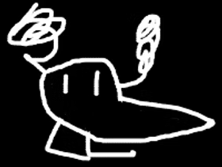

# Team 31828 - The ACrobots
1. [Practice Schedule](#current-practice-schedule)
2. [Mascot](#mascot)
3. [Qualififers attended](#qualifiers-attended)

## Current Practice Schedule
| Sunday | Monday |Tuesday| Wednesday| Thursday | Friday | Saturday |
| --- | --- | --- | --- | --- | --- | ---|
| --- | --- | --- | --- | 5pm-8pm [@Western Maryland Works](https://www.allegany.edu/western-maryland-works/index.html) | --- | --- |

## Mascot:

## Qualifiers attended
[FTC Scout](https://ftcscout.org/teams/31828)
### DECODE 2025-26
1. [Baltimore I](https://www.firstchesapeake.org/ftc-q/2026/uschsbaq1)
2. [Union Bridge III](https://ftcscout.org/events/2025/USCHSUBQ3/matches)

